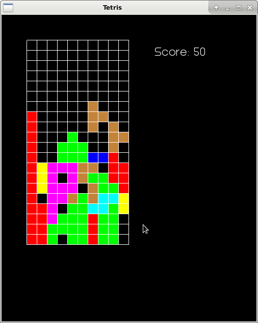
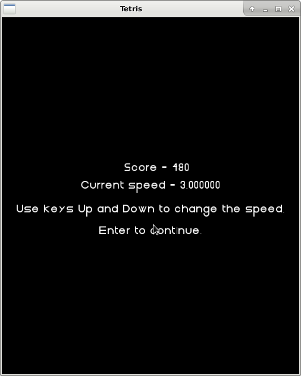

# Tetris sa _stanjima_

U ovom je zadatku potrebno doraditi _Tetris_ igru dodavanjem
pozdravnog ekrana i ekrana za promjenu brzine igre.
Nakon što se pritisne bilo koja tipka počinje igra.
Igrač dobiva ekran igre:

Kada igra završi ne ispisuje se više _Game Over_ već
se icrtava novi ekran na kojem se
prikazuje postignuti broj bodova i dozvoljava se
promjena brzine igre.

 Na zadnjem ekranu igrač može povećati ili smanjiti
 brzinu igre s tipkama `Up` i `Down` te započeti novu
 igu s `Return`. Igra se prekida klikom na  `x`.
